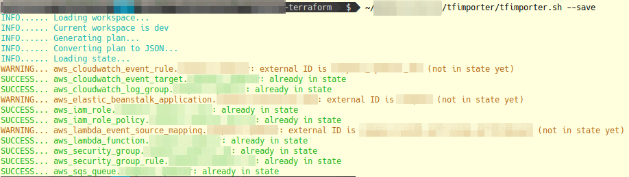
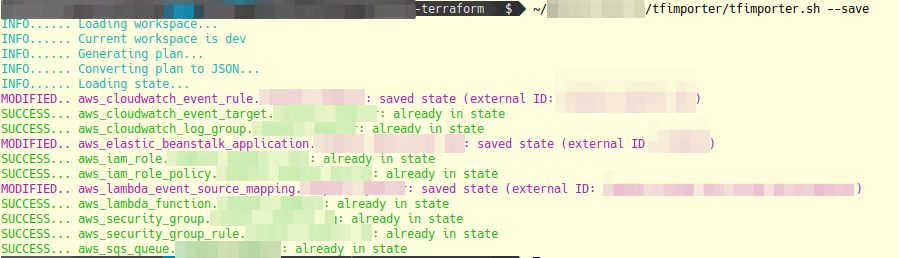

# tfimporter (Terraform importer)

tfimporter is an script that tries to automatically discover and import existing resources into the Terraform state. This is a very preliminar version and only fits my requirements, but can be the base for a better script, or for accepting pull requests.

The workflow of the script is:

* Generate a Terraform plan and save it in a temporary file
* Dump the temporary plan file to JSON
* Load the current state
* Loop the resources in the plan:
    * If the resource is already in the state, do nothing
    * If not, find the importe plugins that can handle the resource type
    * If any plugin found, call it to fetch the resource _external ID_
    * If the _external ID_ has been resolved, import it in the state

The importer plugins are very simple Python modules that tries to guess the _external ID_ of a resource from its parameters; the signature of the plugin main method is this:

```python
class MyCustomImporter(Importer):
    def get_resource_id(self, resource_provider: str, resource_type: str, terraform_resource_name: str, terraform_values: Dict[str, Any], full_context: Dict[str, Any]) -> Optional[str]:
        pass
```

And the values received, got from the Terraform plan, are these (for example, for a [Beanstalk application](https://www.terraform.io/docs/providers/aws/r/elastic_beanstalk_application.html)):

* resource_provider: aws
* resource_type: aws_elastic_beanstalk_application
* terraform_resource_name: my_beanstalk_app
* terraform_values:
    * name: my_beanstalk_app
    * description: my_beanstalk_app
    * appversion_lifecycle: ....
    * tags
        * Project: my_project
        * Environment: my_environment

Using these values, the importer plugin connects to AWS using [boto3](https://boto3.amazonaws.com/v1/documentation/api/latest/reference/services/elasticbeanstalk.html) and tries to guess the resource ID that must be used in [terraform import](https://www.terraform.io/docs/import/index.html); in this case, the name of the resource to import [is the same as the Beanstalk application](https://www.terraform.io/docs/providers/aws/r/elastic_beanstalk_application.html#import), but in other cases, it can be:

* the ARN
* for a [role policy](tfimporter/importers/iam_role_policy.py), is the role name, plus ":", plus the policy name
* for an [Cloudwatch event target](tfimporter/importers/clooudwatch_event_target.py), is the rule name, plus "/", plus the target ID

In general, all Terraform resources that can be imported have a section called "Import" in its documentation page, specifying the way to import the resources.

The current available importers are located in the [tfimporter/importers](tfimporter/importers) package.

## Installation

Requierements:

* [Python 3.7](https://www.python.org/)
* [pipenv](https://pipenv-es.readthedocs.io/)
* [boto3](https://boto3.amazonaws.com/v1/documentation/api/latest/index.html)
* [colorama](https://pypi.org/project/colorama/)
* [Terraform](https://www.terraform.io/)

No automatic installation method yet...

```bash
python3.7 -m pip install pipenv --user

cd ~
[[ ! -d tfimporter ]] && git clone https://github.com/okelet/tfimporter
cd tfimporter
git pull
pipenv install
```

And the run the script from your directory where you have the Terraform configurations (note: the `$(pwd)` is because the script need an absolute path to the Terraform directory, as the script needs to `cd` to the Python project directory):

```bash
~/tfimporter/tfimporter.sh $(pwd)
```



The previous command would show what is going to do; to really import the resources into the state, run the previous command with the `--save` option:

```bash
~/tfimporter/tfimporter.sh $(pwd) --save
```



## Limitations

* The [assume_role](https://www.terraform.io/docs/providers/aws/index.html#assume-role) option for the AWS provider config is ignored
* Only a few AWS modules are implemented so far

## License

[GNU General Public License v3.0](https://choosealicense.com/licenses/gpl-3.0/)

## Me

Website (in spanish): <https://okelet.netlify.com>

Email: [okelet@gmail.com](mailto:okelet@gmail.com)
